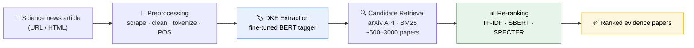

<div align="center">

# Finding Scientific Evidence for Scientific News

**An end-to-end NLP pipeline that takes a science news article and retrieves the research papers it should have cited.**

[](https://www.python.org/)
[](https://www.tensorflow.org/)
[](https://pytorch.org/)
[](#-publications)
[](LICENSE)

[Overview](#-overview) · [Pipeline](#-pipeline) · [Results](#-results) · [Publications](#-publications) · [Quickstart](#-quickstart) · [Modules](#-modules)

</div>

---

## 📌 Overview

Science journalism moves discoveries from the lab to the public, but a large share of science news either cites no source at all or paraphrases the original work so loosely that the claim drifts from what the paper actually showed. Checking those links by hand does not scale.

This repository is the code behind a four-paper research program on **automating that check**. Given only the text of a news article, the system extracts the scientific concepts it is really about, queries a scholarly digital library, and re-ranks the candidates to surface the paper the article most likely came from.

The central idea is **domain knowledge entities (DKEs)** — noun phrases carrying domain-specific meaning ("AG Draconis", "symbiotic binary system") as opposed to generic named entities or keyphrases. DKEs survive the vocabulary gap between newsroom prose and academic writing, which makes them far better retrieval queries than keywords. Swapping keyphrases for DKEs is what takes retrieval precision from 18% to 50% at rank 1.

**Why it may interest you**

- A complete, working retrieval pipeline — not a single model in isolation
- A systematic comparison of nine sequence-tagging architectures for scientific NER
- A systematic comparison of eight document representations for news↔paper matching
- Runtime measured alongside accuracy, because the target was a deployable service

---

## 🔭 Pipeline



A fourth module, **claim extraction**, runs alongside the pipeline: it identifies which sentences in a scientific abstract actually assert a claim, so that a retrieved paper can later be compared against the news article claim-by-claim.

---

## 📊 Results

### Evidence retrieval — end-to-end system

Precision at rank *K* on 100 manually curated (news, paper) pairs. All settings retrieve from arXiv; they differ in what is used as the query and how documents are represented for re-ranking.

| Query type | Extractor | Representation | P@1 | P@5 | P@10 | P@50 | MRR | Total time |
|---|---|---|---:|---:|---:|---:|---:|---:|
| Keyphrases | TextRank | TF-IDF | 18% | 23% | 23% | 29% | 0.19 | 21 s |
| Named entities | CoreNLP | TF-IDF | 38% | 44% | 45% | 47% | 0.40 | 14 s |
| DKEs | HESDK | TF-IDF | 39% | 45% | 49% | 60% | 0.43 | 116 s |
| **DKEs** | **BERT** | **TF-IDF** | **50%** | **71%** | **74%** | 86% | **0.59** | 67 s |
| DKEs | BERT | SBERT | 47% | 69% | 74% | 90% | 0.57 | 119 s |
| DKEs | BERT | SPECTER | 47% | 69% | 73% | **91%** | 0.57 | 110 s |

Two findings worth pulling out. First, **the query matters more than the ranker** — every DKE-based setting beats every keyphrase or named-entity setting. Second, **TF-IDF wins at low K and loses at high K**: literal term overlap finds the single right paper, while dense representations recover the paraphrased matches further down the list. That crossover suggests an ensemble re-ranker as the natural next step.

### DKE extraction — model comparison

Fine-tuned BERT reaches **F1 = 0.92–1.00** across all ten OA-STM domains, effectively saturating the task. Models trained from scratch on the small annotated corpus land far lower — ELMo-BiLSTM, the best of them, reaches F1 ≈ 0.51–0.54 on materials science, biology and chemistry. The gap is a clean illustration of how much pre-training carries a low-resource tagging task.

---

## 📚 Publications

Four peer-reviewed papers came out of this work.

| # | Paper | Venue | Module |
|---|---|---|---|
| 1 | Searching for Evidence of Scientific News in Scholarly Big Data | [K-CAP 2019](https://dblp.org/rec/conf/kcap/HoqueBKCLW19) | System |
| 2 | A Comparative Study of Sequence Tagging Methods for Domain Knowledge Entity Recognition in Biomedical Papers | [JCDL 2020](https://dblp.org/rec/conf/jcdl/WuHRWBGLK20) | [`dke_extraction/`](dke_extraction/) |
| 3 | SciEv: Finding Scientific Evidence Papers for Scientific News | [arXiv:2205.00126](https://arxiv.org/abs/2205.00126) | [`evidence_retrieval/`](evidence_retrieval/) |
| 4 | ClaimDistiller: Scientific Claim Extraction with Supervised Contrastive Learning | [EEKE/AII @ JCDL 2023](https://dblp.org/rec/conf/eeke/WeiH0023) | [`claim_extraction/`](claim_extraction/) |

Full publication list: [Google Scholar](https://scholar.google.com/citations?user=_uefhgUAAAAJ&hl=en)

---

## 🗂️ Modules

| Directory | What it contains | Paper |
|---|---|---|
| [`dke_extraction/`](dke_extraction/) | Nine sequence-tagging models for domain knowledge entity recognition — BiLSTM-CRF, character embeddings, self-attention, ELMo, BERT/RoBERTa | JCDL 2020 |
| [`evidence_retrieval/`](evidence_retrieval/) | The SciEv retrieval system: candidate retrieval plus eight document-representation re-rankers and ranking metrics | SciEv 2022 |
| [`claim_extraction/`](claim_extraction/) | ClaimDistiller — claim vs. non-claim sentence classification with supervised contrastive learning and transfer learning | EEKE 2023 |
| [`demo/`](demo/) | End-to-end script: give it a news URL, get back DKEs and candidate papers | — |

Each directory has its own README with model descriptions, data setup and run instructions.

---

## ⚡ Quickstart

```bash
git clone https://github.com/reshadshuvo123/scientific-news-evidence.git
cd scientific-news-evidence

python -m venv .venv && source .venv/bin/activate
pip install -r requirements.txt
python -c "import nltk; nltk.download('punkt'); nltk.download('averaged_perceptron_tagger')"
```

Run the end-to-end demo on a news article:

```bash
python demo/extract_entities_from_url.py --url "https://www.sciencealert.com/some-article"
```

Or reproduce a single re-ranking setting:

```bash
python evidence_retrieval/rank_tfidf.py
```

> **Note on vintage.** This code was written between 2019 and 2023 against TF 1.x/2.x and Keras. Pinned versions are in `requirements.txt`. The transformer components (BERT tagging, SBERT, SPECTER) run on modern `transformers` and `sentence-transformers` without changes; the CRF and ELMo components need the pinned stack.

---

## 💾 Datasets

| Dataset | Used for | Source |
|---|---|---|
| **News–paper pairs** (100 curated) | End-to-end evaluation | Compiled for this work from ScienceAlert, ScienceNews, EurekAlert, Forbes |
| **SemEval-2017 Task 10** | DKE extractor pre-training | [ScienceIE](https://scienceie.github.io/) |
| **OA-STM** | DKE extractor fine-tuning (10 domains) | [Elsevier Labs](https://github.com/elsevierlabs/OA-STM-Corpus) |
| **Biomedical claims** (1,500 expert-annotated abstracts) | Claim extraction | [titipata/detecting-scientific-claim](https://github.com/titipata/detecting-scientific-claim) |

The 100 news–paper pairs were, at time of publication, the first dataset of this kind.

---

## 📝 Citation

If you use this work, please cite the relevant paper:

```bibtex
@article{hoque2022sciev,
  title   = {SciEv: Finding Scientific Evidence Papers for Scientific News},
  author  = {Hoque, Md Reshad Ul and Li, Jiang and Wu, Jian},
  journal = {arXiv preprint arXiv:2205.00126},
  year    = {2022}
}

@inproceedings{hoque2019searching,
  title     = {Searching for Evidence of Scientific News in Scholarly Big Data},
  author    = {Hoque, Md Reshad Ul and Bradley, Dash and Kwan, Chiman and
               Chiatti, Agnese and Li, Jiang and Wu, Jian},
  booktitle = {Proceedings of the 10th International Conference on Knowledge Capture (K-CAP)},
  pages     = {251--254},
  year      = {2019}
}

@inproceedings{wei2023claimdistiller,
  title     = {ClaimDistiller: Scientific Claim Extraction with Supervised Contrastive Learning},
  author    = {Wei, Xin and Hoque, Md Reshad Ul and Wu, Jian and Li, Jiang},
  booktitle = {Joint Workshop of EEKE2023 and AII2023, co-located with JCDL 2023},
  pages     = {65--77},
  year      = {2023}
}

@inproceedings{wu2020comparative,
  title     = {A Comparative Study of Sequence Tagging Methods for Domain Knowledge
               Entity Recognition in Biomedical Papers},
  author    = {Wu, Jian and Hoque, Md Reshad Ul and Reiske, Gunnar W. and
               Weigle, Michele C. and Bradshaw, Brenda T. and Gaff, Holly D. and
               Li, Jiang and Kwan, Chiman},
  booktitle = {Proceedings of the ACM/IEEE Joint Conference on Digital Libraries (JCDL)},
  pages     = {397--400},
  year      = {2020}
}
```

---

## 👤 Author

**Md Reshad Ul Hoque** — PhD, Electrical & Computer Engineering, Old Dominion University

[](https://scholar.google.com/citations?user=_uefhgUAAAAJ&hl=en)
[](https://www.linkedin.com/in/reshadshuvo123/)
[](https://github.com/reshadshuvo123)

This work was carried out with Dr. Jiang Li (ECE) and Dr. Jian Wu (CS) at Old Dominion University.

## 📄 License

MIT — see [LICENSE](LICENSE). Third-party datasets carry their own licenses.
