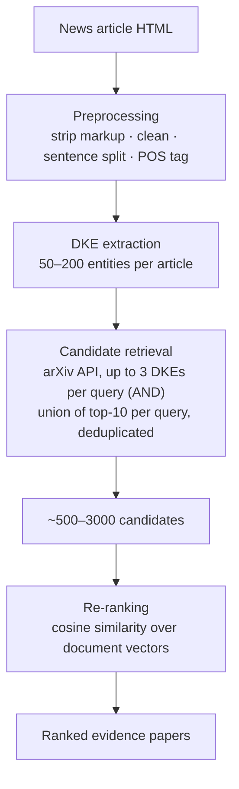

# 🔍 SciEv — Evidence Paper Retrieval

> **Paper:** M. R. U. Hoque, J. Li, J. Wu. *SciEv: Finding Scientific Evidence Papers for Scientific News.*
> [arXiv:2205.00126](https://arxiv.org/abs/2205.00126)

## What this module does

Given a science news article, find the research paper it came from.

This is a citation-recommendation problem with an unusual shape: the citing document is journalism and the cited document is a paper. That makes it harder than the usual paper→paper case for three reasons — reporters paraphrase technical language into readable prose, so vocabulary barely overlaps; there is no dense citation graph between news and papers to exploit; and almost no labelled data existed.

SciEv handles it with a two-stage retrieval design.



**Stage 1 — recall.** Rather than one query, the system fires many: each is a single DKE or a conjunction of up to three. Results are unioned and deduplicated by title and authors. This narrows millions of arXiv papers to a few thousand, which is what makes vector ranking tractable at all.

**Stage 2 — precision.** Candidates are re-ranked by cosine similarity between the news article vector and the paper abstract vector. Which representation to use is the open question this module answers empirically.

## Document representations compared

| Representation | File | Notes |
|---|---|---|
| TF-IDF bag-of-words | `rank_tfidf.py` | Sparse vectors over the retrieval corpus (article + its candidates), so IDF is computed locally rather than against a global corpus. |
| Averaged word2vec | `rank_word2vec.py` | 300-d pre-trained vectors, mean-pooled. No word order. |
| Doc2Vec | `rank_doc2vec.py` | Gensim paragraph vectors. |
| TF-IDF-weighted Doc2Vec | `rank_doc2vec_tfidf.py` | Word vectors weighted by TF-IDF before averaging. |
| SciBERT | `rank_scibert.py` | Encoder pre-trained on scientific text; token vectors mean-pooled. |
| SciBERT bag-of-concepts | `rank_scibert_boc.py` | Concept-clustered variant. |
| SBERT | `rank_sbert.py` | Siamese sentence encoder, sentence embeddings averaged over the document. |
| SPECTER | `rank_specter.py` | SciBERT backbone trained with citation-informed objectives; built from title + abstract. |

Baselines for the query side: `rank_textrank_baseline.py` (unsupervised keyphrases) and `rank_no_dke_baseline.py` (no DKEs at all).

`metrics.py` implements MRR, NDCG with binary relevance, and P@K.

## Results

Evaluated on 100 manually curated (news, paper) pairs.

| Query type | Extractor | Representation | P@1 | P@5 | P@10 | P@20 | P@50 | MRR | NDCG | Rank time | Total |
|---|---|---|---:|---:|---:|---:|---:|---:|---:|---:|---:|
| Keyphrases | TextRank | TF-IDF | 18% | 23% | 23% | 28% | 29% | 0.19 | 0.22 | 0.8 s | 21 s |
| Named entities | CoreNLP | TF-IDF | 38% | 44% | 45% | 46% | 47% | 0.40 | 0.44 | 0.8 s | 14 s |
| DKEs | HESDK | TF-IDF | 39% | 45% | 49% | 55% | 60% | 0.43 | 0.48 | 0.8 s | 116 s |
| **DKEs** | **BERT** | **TF-IDF** | **50%** | **71%** | **74%** | 80% | 86% | **0.59** | **0.70** | **0.8 s** | 67 s |
| DKEs | BERT | word2vec | 20% | 37% | 41% | 55% | 69% | 0.28 | 0.40 | 4.0 s | 142 s |
| DKEs | BERT | Doc2Vec | 36% | 51% | 54% | 64% | 71% | 0.43 | 0.52 | 366 s | 460 s |
| DKEs | BERT | Weighted Doc2Vec | 35% | 55% | 60% | 68% | 84% | 0.43 | 0.55 | 351 s | 473 s |
| DKEs | BERT | SciBERT | 19% | 30% | 36% | 43% | 67% | 0.25 | 0.36 | 733 s | 876 s |
| DKEs | BERT | SBERT | 47% | 69% | 74% | 82% | 90% | 0.57 | 0.69 | 10 s | 119 s |
| DKEs | BERT | SPECTER | 47% | 69% | 73% | **84%** | **91%** | 0.57 | 0.69 | 4.2 s | 110 s |

### Reading the table

**The query type dominates.** Every DKE setting beats every keyphrase or named-entity setting, regardless of ranker. Replacing TextRank keyphrases with BERT-extracted DKEs nearly triples P@1. If you take one thing from this work, it is that what you search with matters more than how you rank.

**TF-IDF and dense embeddings trade places at K ≈ 20.** TF-IDF is best at K = 1, 5, 10; SPECTER is best at K = 20 and 50, pulling 91% of correct papers into the top 50 against TF-IDF's 86%. The interpretation: when a news article reuses the paper's exact terminology, literal overlap nails it immediately. When the reporter paraphrased heavily, only semantic representations find the match — but they find it further down the list. An ensemble re-ranker is the obvious follow-up.

**Naïve mean-pooling of SciBERT underperforms badly** — worse than word2vec at low K, and by far the slowest. Averaging token vectors from a masked language model does not produce a good document vector; SBERT and SPECTER, trained explicitly for that objective, do.

**Runtime is a real constraint.** TF-IDF re-ranks in 0.8 seconds and the whole pipeline in 67. SPECTER roughly doubles the total. Doc2Vec and SciBERT are impractical for interactive use.

### Where it fails

Error analysis pointed at one dominant cause: articles containing too few DKEs to query with. Pieces that carry their content in images, video or equations rather than technical prose leave the extractor with almost nothing to work from.

## Data

100 news articles from ScienceAlert, ScienceNews, EurekAlert and Forbes, each manually curated to link to at least one source paper (up to five). Average length 900–1,000 words, spanning history, art, astronomy, biology, environment, computer science and medicine. To our knowledge this was the first dataset of its kind.

## Running it

```bash
# Best-performing setting
python rank_tfidf.py

# Dense re-rankers
python rank_sbert.py
python rank_specter.py

# Baselines
python rank_textrank_baseline.py
python rank_no_dke_baseline.py
```

The target news URL is set at the top of each script. Retrieval hits the public arXiv API, so an internet connection is required and heavy runs should be rate-limited.
